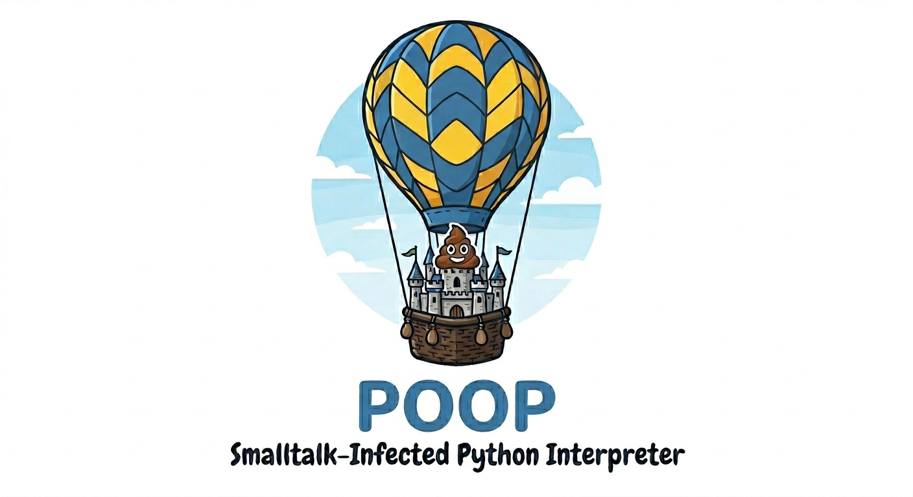

<p align="center">
  
</p>

# POOP 💩

**POOP** — **P**ython **O**bject **O**riented **P**rogramming. A Python 3.14 interpreter that enforces Smalltalk-style message passing by rejecting `if`/`for`/`print`/`isinstance` and rewriting Python literals (`1`, `"hi"`, `True`, `[…]`, `{…}`) into POOP types where every operation is a message to a receiver.

POOP is for **educational exploration of message-passing semantics inside the Python ecosystem**, not for production. POOP is not distributed via PyPI by design, and there are no tagged releases; clone and run it locally.

## Install

```bash
git clone https://github.com/cassiobotaro/poop.git
cd poop
uv sync
uv run poop examples/basics/hello_world.py
```

Contributor / development setup lives in [`CONTRIBUTING.md`](CONTRIBUTING.md).

## Hello, POOP

```python
"Hello, World!".print()
```

Run it:

```bash
poop hello.py            # run a file
poop                     # interactive REPL (Ctrl+D to exit)
```

Inside the REPL, colon-prefixed meta-commands help you explore,
Smalltalk-browser style:

```
>>> :methods "abc"       # the messages an object understands
>>> :explain if          # why a construct is forbidden + the substitute
>>> :help                # list the meta-commands
```

## The ten essentials

| Python | POOP |
|---|---|
| `print(x)` | `x.print()` |
| `if cond: …` / `else:` | `cond.if_true(lambda: …)` / `cond.if_true_if_false(lambda: …, lambda: …)` |
| `for x in col: …` | `col.do(lambda x: …)` |
| `while cond: …` | `(lambda: cond).while_true(lambda: …)` |
| `len(x)` | `x.len()` |
| `x[i]` | `x.at(i)` |
| `x[a:b]` | `x.slice(a, b)` |
| `not x` | `x.not_()` |
| `x and y` / `x or y` | `x.and_(lambda: y)` / `x.or_(lambda: y)` |
| `-x` | `x.negated()` |

Full Python → POOP recipe book: [`MIGRATION.md`](MIGRATION.md). Design rationale: [`INFECTIONS.md`](INFECTIONS.md).

## What's banned (and what to use instead)

POOP runs ~65 validators on every program. Grouped by theme:

**Control flow** — messages on a Boolean, not statements.
- `if` / `else` / ternary → `cond.if_true(lambda: …)` / `cond.if_true_if_false(lambda: …, lambda: …)`
- `for` / `while` / `match` → `col.do(…)` / `(lambda: cond).while_true(…)` / polymorphism
- `with` / `try` / `raise` / `assert` → `With(lambda: cm()).do(…)` / `Try(lambda: …).except_(ExcType, lambda e: …).run()` / `ValueError.raise_("msg")` / `obj.assert_("msg")`

**Free functions** — call as a method on the receiver.
- `print` / `len` / `abs` / `hash` / `round` / `pow` / `divmod` / `min` / `max` / `sum` / `sorted` / `reversed` → `x.print()`, `x.len()`, `x.abs()`, `x.hash()`, …
- `map` / `filter` → `col.map(lambda x: …)` / `col.filter(lambda x: …)`
- `ascii` / `bin` / `chr` / `repr` / `format` → corresponding methods on `Int` / `Str`
- `input` / `open` → `"prompt".input()` / `Path("file").read_text()`
- `iter(col)` → `col.iter()` returns an iterator; `it.next()` advances it

**Introspection** — call the method on the receiver, or use polymorphism.
- `isinstance(x, T)` / `issubclass(C, P)` → `x.is_instance(T)` / `C.is_subclass(P)`
- `callable(x)` / `id(x)` / `dir(x)` → `x.callable()` / `x.id()` / `x.dir()`
- `hasattr(x, n)` / `getattr(x, n)` / `setattr(x, n, v)` → `x.has_attr(n)` / `x.get_attr(n)` / `x.set_attr(n, v)`

**Operator sugar** — methods on the receiver.
- `x[i]` / `x[a:b]` → `x.at(i)` / `x.slice(a, b)`
- `not x` / `x and y` / `x or y` → `x.not_()` / `x.and_(lambda: y)` / `x.or_(lambda: y)`
- `-x` / `+x` / `~x` → `x.negated()` / drop the `+` / `x.bit_invert()`
- `x is None` / `x in y` → `x.is_none()` / `y.includes(x)` (identity via `x.is_identical(y)`)

**Syntax shortcuts that hide behaviour.**
- comprehensions (`[x for x in …]`, `{…}`, generator exprs) → explicit `.map` / `.filter` / `.do`
- top-level `def` (free functions) → define as a method inside a class
- `yield` / walrus `:=` / `del` / `global` → out of scope

**Side-channels.**
- `exec` / `breakpoint` / `exit` — interpreter escape hatches forbidden

The full catalog with one row per validator and the substitute recipe lives in [`INFECTIONS.md`](INFECTIONS.md).

## Learn by example

[`examples/`](examples/) ships 41 programs across three subfolders, grouped by what they teach.

**Language basics** ([`examples/basics/`](examples/basics/))
- [`hello_world.py`](examples/basics/hello_world.py) — the smallest POOP program
- [`greet.py`](examples/basics/greet.py) — string input + concatenation
- [`fizzbuzz.py`](examples/basics/fizzbuzz.py) — control flow via `if_true_if_false`
- [`leap_year.py`](examples/basics/leap_year.py) — `and_` / `or_` / `not_`
- [`collatz.py`](examples/basics/collatz.py) — while-style recursion
- [`grades.py`](examples/basics/grades.py) — collection processing
- [`slicing.py`](examples/basics/slicing.py) — `Slice` as a reusable value object
- [`bank_account.py`](examples/basics/bank_account.py) — encapsulation

**Idiomatic POOP** ([`examples/idiomatic/`](examples/idiomatic/))
- [`pipeline.py`](examples/idiomatic/pipeline.py) — `filter` / `filter_false` / `map` / `do` chain
- [`safe_config.py`](examples/idiomatic/safe_config.py) — `if_none` / `if_not_none` cascade
- [`common_interests.py`](examples/idiomatic/common_interests.py) — set operations
- [`statistics.py`](examples/idiomatic/statistics.py) — number aggregation
- [`rpn_calculator.py`](examples/idiomatic/rpn_calculator.py) — stack as a POOP `List`
- [`roman_numerals.py`](examples/idiomatic/roman_numerals.py) — string mapping

**Classic OO patterns** (Sandi Metz / GoF) ([`examples/patterns/`](examples/patterns/))

*Creational*
- [`abstract_factory.py`](examples/patterns/abstract_factory.py) — Abstract Factory
- [`builder.py`](examples/patterns/builder.py) — Builder
- [`factory_method.py`](examples/patterns/factory_method.py) — Factory Method
- [`singleton.py`](examples/patterns/singleton.py) — Singleton (class-side cached instance)

*Structural*
- [`adapter.py`](examples/patterns/adapter.py) — Adapter
- [`bridge.py`](examples/patterns/bridge.py) — Bridge
- [`tree.py`](examples/patterns/tree.py) — Composite (replacing `isinstance`)
- [`decorators.py`](examples/patterns/decorators.py) — Decorator (composition by delegation)
- [`facade.py`](examples/patterns/facade.py) — Facade
- [`flyweight.py`](examples/patterns/flyweight.py) — Flyweight (shared intrinsic state)
- [`proxy.py`](examples/patterns/proxy.py) — Proxy (lazy-loading virtual proxy)

*Behavioral*
- [`chain_of_responsibility.py`](examples/patterns/chain_of_responsibility.py) — Chain of Responsibility
- [`command.py`](examples/patterns/command.py) — Command (with undo)
- [`interpreter.py`](examples/patterns/interpreter.py) — Interpreter
- [`iterator.py`](examples/patterns/iterator.py) — Iterator
- [`mediator.py`](examples/patterns/mediator.py) — Mediator
- [`memento.py`](examples/patterns/memento.py) — Memento
- [`observer.py`](examples/patterns/observer.py) — Observer
- [`door.py`](examples/patterns/door.py) — State
- [`discounts.py`](examples/patterns/discounts.py) — Strategy
- [`template_method.py`](examples/patterns/template_method.py) — Template Method
- [`visitor.py`](examples/patterns/visitor.py) — Visitor

*Other OO patterns (Fowler / Beck / Evans / Metz)*
- [`null_customer.py`](examples/patterns/null_customer.py) — Null Object
- [`payroll.py`](examples/patterns/payroll.py) — polymorphism replacing `if employee.type == ...`
- [`specification.py`](examples/patterns/specification.py) — Specification (composable rules replacing `and`/`or`/`not`)
- [`money.py`](examples/patterns/money.py) — Money value object
- [`execute_around.py`](examples/patterns/execute_around.py) — Execute Around Method

## Type annotations

Annotations (`x: int`, `def f(x: int) -> str:`) are not evaluated at runtime in Python and do not cause errors in POOP programs, but they are misleading: POOP transforms every literal to its own types (`Int`, `Str`, …), so a variable annotated as `int` holds an `Int` at runtime. Avoid annotations in POOP code. `type X = int` is explicitly banned by the validator pipeline.

## Where to next

- [`MIGRATION.md`](MIGRATION.md) — full Python → POOP recipe book
- [`INFECTIONS.md`](INFECTIONS.md) — every validator / transformer / type, with rationale
- [`proposals.md`](proposals.md) — open design backlog
- [`CONTRIBUTING.md`](CONTRIBUTING.md) — dev setup, atomic-commit conventions, versioning
- [Issues](https://github.com/cassiobotaro/poop/issues) — bugs and feature requests
