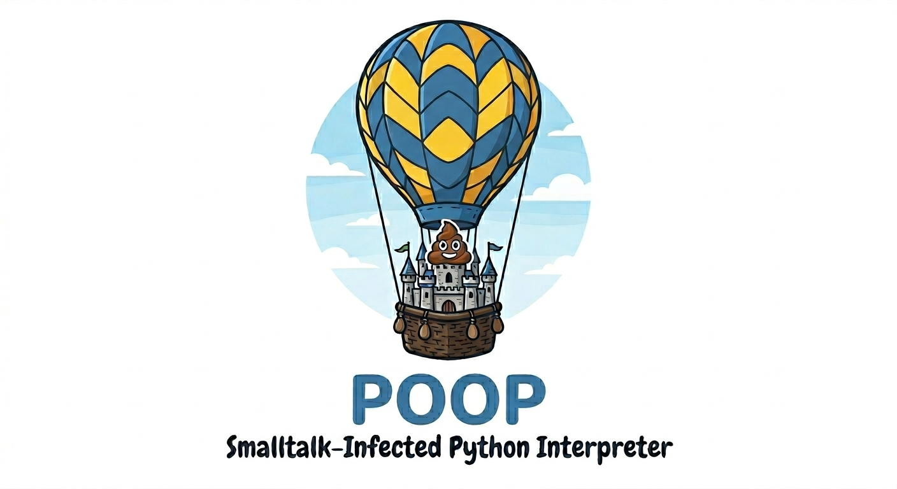

<p align="center">
  
</p>

# POOP 💩

**P**ython **O**bject **O**riented **P**rogramming: Python 3.15, infected by Smalltalk.

In POOP there is no `if`, no `for`, no `print()`. Every literal is an object, and every operation is a message sent to one. `True` decides for itself, a list walks itself, a string prints itself.

```python
"Hello, World!".print()
```

POOP runs 73 validators on every program, and each one that refuses tells you what to write instead:

```console
$ poop loop.py
poop: for loops are forbidden — use col.do(block) instead
  1 | for i in range(3):
    | ^
```

POOP is a playground for exploring message passing without leaving Python, not a production tool. It is not on PyPI and has no releases: clone it and play.

## Try it

```bash
git clone https://github.com/cassiobotaro/poop.git
cd poop
uv sync
uv run poop examples/basics/fizzbuzz.py
```

Run `uv run poop` with no arguments for the REPL. `:methods "abc"` lists what an object understands, and `:explain if` says why a construct is gone and what replaces it.

## FizzBuzz, the POOP way

```python
range(1, 16).do(
    lambda i: (i % 15 == 0).if_true_if_false(
        lambda: "FizzBuzz".print(),
        lambda: (i % 3 == 0).if_true_if_false(
            lambda: "Fizz".print(),
            lambda: (i % 5 == 0).if_true_if_false(
                lambda: "Buzz".print(),
                lambda: i.print(),
            ),
        ),
    )
)
```

The range is asked to `do` something for each number. Each comparison answers a Boolean, and the Boolean picks which block to run.

## The ten essentials

| Python | POOP |
|---|---|
| `print(x)` | `x.print()` |
| `if cond: …` / `else:` | `cond.if_true(lambda: …)` / `cond.if_true_if_false(lambda: …, lambda: …)` |
| `for x in col: …` | `col.do(lambda x: …)` |
| `while cond: …` | `(lambda: cond).while_true(lambda: …)` |
| `len(x)` | `x.len()` |
| `x[i]` | `x.at(i)` |
| `x[a:b]` | `x.slice(a, b)` |
| `not x` | `x.not_()` |
| `x and y` / `x or y` | `x.and_(lambda: y)` / `x.or_(lambda: y)` |
| `-x` | `x.negated()` |

## Learn by example

[`examples/`](examples/) goes from hello world to the whole Gang of Four catalogue: Composite in place of `isinstance`, State in place of `if`, Null Object in place of `None` checks.

## Where to next

- [`examples/`](examples/): every example program, grouped by what it teaches
- [`MIGRATION.md`](MIGRATION.md): the Python → POOP recipe book
- [`INFECTIONS.md`](INFECTIONS.md): every ban, rewrite and type, and why each exists
- [`CONTRIBUTING.md`](CONTRIBUTING.md): dev setup and conventions
- [Issues](https://github.com/cassiobotaro/poop/issues): bugs and ideas
